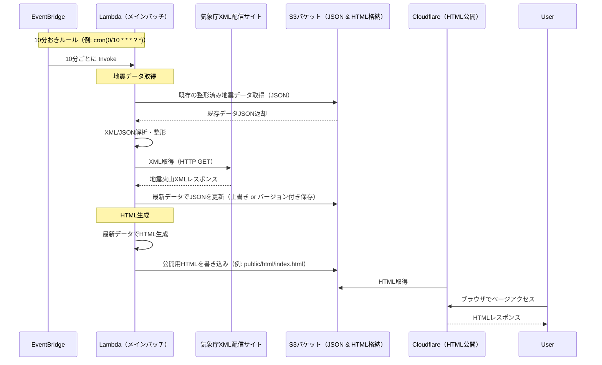
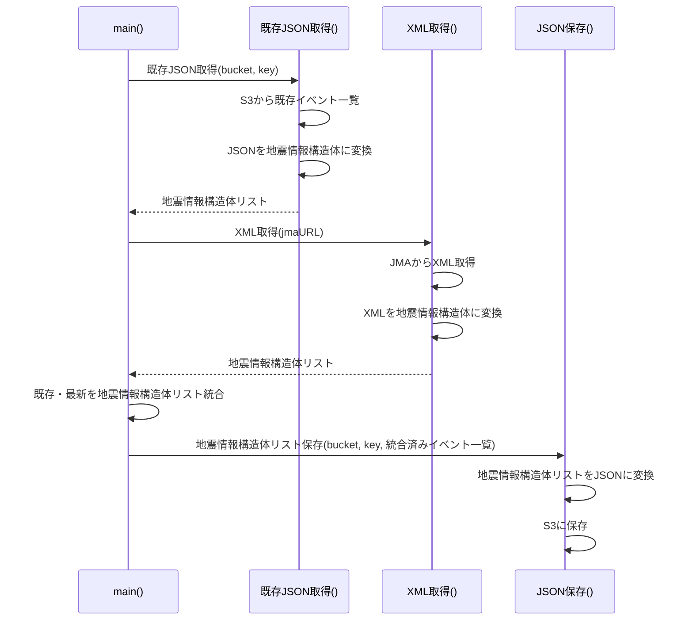
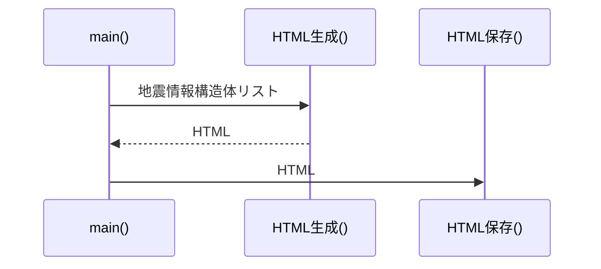

# 地震ランキング
直近7日間の都道府県ごとの地震発生回数をランキングで表示。

## コンセプト

### 最初に思いついたこと
最近の地震の発生傾向を都道府県別にランキングで表示するサイトが無いので作ってみようと思った。
SEOは「地震 最新 ランキング」を狙う。収益化の方針はディスプレイ広告と防災グッズのアフィリエイト。

### どんな誰に？
地震の発生に不安を感じる人。

### どんな価値を提供する？
地震の発生傾向を把握できるようにすることで安心感を提供する。

### どのように解決する？
地震の発生情報を都道府県別に地図上に表示する。

### やる・やらないこと
- **やる:** リアルタイムでの地震情報の反映
    - 完全にリアルタイムは一旦は難しいので、10分おき程度の更新頻度で対応
    - 当面は気象庁のデータをひと目で分かるようにすることに注力
- **やらない:** 過去データの詳細な分析
    - 独自でやらないだけで、既存のデータが利用可能であれば活用はする

## SEO
TODO: キーワード調査、競合調査

## サイト仕様

### 基本情報
- **URL:** https://jishinranking.com
- **更新頻度:** 10分おき
- **データソース:** 気象庁地震火山XML
- **ホスティング:** S3 + Cloudflare
- **バッチ処理:** AWS Lambda + EventBridge

### 表示項目
- 都道府県別地震発生回数ランキング（震度1以上・直近7日間）の表
    - 項目
        - 順位
        - 都道府県名
        - 発生回数
        - 発生割合（全体に対する%）
    - 補足
        - 都道府県別、としつつも実際には「府県予報区名」別
- 地図上での都道府県別地震発生回数のヒートマップ表示
    - 発生回数を基にした色分け
    - 発生割合を10段階程度のグラデーション

## 気象庁地震火山XML
- **配信URL:** https://www.data.jma.go.jp/developer/xml/feed/eqvol.xml
- **公式ドキュメント:** https://xml.kishou.go.jp/xmlpull.html

## シーケンス図（全体）

## シーケンス図（バッチメイン・地震データ取得）
JMAから最新XMLを取得してからS3にデータを保存するまでの処理。

## シーケンス図（バッチメイン・HTML生成）
最新の地震データをもとにHTMLを生成して公開するまでの処理。

## S3バケット設定
バケットは2種類
  - 配信HTMLバケット: Cloudfront経由で公開するためのHTML格納用バケット
  - 地震レポートJSONバケット: Lambdaが地震データを保存・取得するためのバケット
    - 保存ファイルは日付とシーケンス番号で管理する
      - ファイル作成時刻
      - ISO-8601形式
      - UTCタイムゾーン
      - 例: `20251221T153012Z.json`,

## CloudFlare設定（廃止済み）

### 1. S3 を独自ドメインで公開する設定

1. Cloudflare ダッシュボード → **DNS**
2. `A` または `CNAME` レコードを追加

  - **Name**: `www`（または任意のサブドメイン）
  - **Type**: `CNAME`
  - **Target**: `my-bucket.s3-website-ap-northeast-1.amazonaws.com`
3. プロキシは **オレンジクラウド（Proxy ON）** を選択
  → この時点で Cloudflare 経由で S3 の HTML を独自ドメインから配信できます。

### 2. HTML を 10 秒キャッシュする設定

1. Cloudflare ダッシュボード → **Caching** → **Cache Rules**
2. 「Create Rule」
3. 以下のように設定：

  - **If**

    - *Field*: URL Path
    - *Operator*: matches
    - *Value*: `*.html`
  - **Then**（アクション）

    - **Cache level**: *Cache Everything*
    - **Edge TTL**: *10 seconds*

これで Cloudflare は HTML を 10 秒だけ保持し、10 秒ごとに必要に応じて S3 へ再フェッチします。

## Lambda設定

  - **関数名:** `jishinranking-batch`
  - **ランタイム:** Go 最新 (例: `go1.x`)
  - **メモリ:** 256〜512MB 程度（XMLパース+HTML生成を踏まえて、まずは 512MB 推奨）
  - **タイムアウト:** 10〜15秒（JMAレスポンス遅延を考慮、余裕をもたせる）
  - **ハンドラ:** `main`（Go のビルド時に `-o main` でバイナリ化）
  - **環境変数（例）:**

    - `AWS_REGION=ap-northeast-1`
    - `DATA_BUCKET=jishinranking-com`（JSON & HTML 共通バケット）
    - `JSON_KEY=data/events.json`
    - `HTML_KEY=public/html/index.html`
    - `JMA_FEED_URL=https://www.data.jma.go.jp/developer/xml/feed/eqvol.xml`
    - `DAYS_RANGE=7`（直近◯日分を集計するため）
  - **VPC:** 原則 **非VPC**（デフォルトのインターネットアクセスで JMA に直接アクセス）
  - **ログ出力:** CloudWatch Logs に標準出力/標準エラーを送る（後述 IAM ロールで許可）

---
## IAMロール

### Lambda実行ロール（例: `jishinranking-lambda-role`）

  - **信頼ポリシー（Trust Policy）**
    - `Service: lambda.amazonaws.com` を信頼するロール
  - **アタッチするポリシー**

    1. **マネージドポリシー**

      - `AWSLambdaBasicExecutionRole`
        → CloudWatch Logs への `logs:CreateLogGroup`, `logs:CreateLogStream`, `logs:PutLogEvents`
    2. **カスタムポリシー（S3用）** 例: `jishinranking-s3-access-policy`

      - 対象リソース:

        - `arn:aws:s3:::jishinranking-com`
        - `arn:aws:s3:::jishinranking-com/data/*`
        - `arn:aws:s3:::jishinranking-com/public/html/*`
      - 許可アクション:

        - `s3:GetObject`（既存JSON取得・HTMLテンプレート取得を想定する場合）
        - `s3:PutObject`（JSON/HTML 書き込み）
        - `s3:ListBucket`（必要に応じて）
  - **EventBridge用ロール**

    - 通常は EventBridge ルール作成時に自動作成される「ターゲット invoke 用ロール」で十分
    - 明示的に作る場合は `events.amazonaws.com` を信頼し、`lambda:InvokeFunction` を対象 Lambda に対して許可

---

## EventBridge設定

  - **ルール名:** `jishinranking-batch-every-10min`
  - **ルールタイプ:** スケジュール式
  - **スケジュール式:** `cron(0/10 * * * ? *)`

    - 日本時間を厳密に気にする必要はない（Lambda はUTCベースで 10分間隔実行）
  - **ターゲット:**

    - **ターゲットタイプ:** Lambda 関数
    - **ターゲット:** `jishinranking-batch` 関数 ARN
  - **再試行/エラー時の処理:**

    - 重要度を考えると、**デフォルトの再試行 + DLQ（SQS） or 通知（SNS）** を設定しておくと安心
    - 例: SQS キュー `jishinranking-batch-dlq` を設定して失敗イベントを保管
  - **インプット:**

    - 特に不要なので「Constant (JSON text)」で `{}` を渡すか、空のまま
    - もし「強制フル再計算」などのモードを切り替えたい場合は、ここにフラグを入れる設計もあり

---

## S3バケット設定

  - **バケット名:** `jishinranking-com`（リージョン: `ap-northeast-1`）
  - **用途:**

    - `data/events.json` … 直近7日分の整形済み地震データ（Lambdaが更新）
    - `public/html/index.html` … 公開用HTML（Lambdaが生成）
    - 必要なら `public/assets/*` にCSS/画像など
  - **ディレクトリ（プレフィックス）構成例:**

    - `data/events.json`
    - `public/html/index.html`
    - `logs/`（Lambdaなどからの任意ログファイル、必要なら）
  - **バケットポリシー:**

    - JSON など内部用データ: 原則 **非公開**
    - `public/html/*` のみ **読み取りパブリック** または **Cloudflare からのみ GET 許可**
      （簡単に始めるならパブリック読み取り、後で Cloudflare IP 制限に切り替え）
  - **静的ウェブサイトホスティング:**

    - 有効にして `index.html` を指定
    - Cloudflare のオリジンに「S3ウェブサイトエンドポイント」を向ける（例: `jishinranking-com.s3-website-ap-northeast-1.amazonaws.com`）
  - **バケットのパブリックアクセスブロック:**

    - サイトを完全に公開する場合は、「バケット全体をブロック」ではなく

      - バケットレベルのブロックをOFFにしつつ
      - パブリックを許可するのは `public/html/*` に限定するポリシーにする
  - **ライフサイクルルール（任意だが推奨）:**

    - `data/events.json` の履歴を別プレフィックスに保存する場合は、**8〜14日後に削除** するルール
    - 将来的に過去データを溜めたい場合は、`data/archive/YYYY/MM/dd/` に日次で保存し、必要に応じて Glacier へ移行するルールも検討可

## Terraform

## 不明点
- 関数のインターフェース・ドメインモデルを定義は？
- terraformで
- CloudFlareでのHTML公開の詳細は？
- HTMLテンプレートの設計は？
- 約何分後にHTML更新、みたいなカウントダウン表示は可能か？（目的としては、ユーザーに最新データが近々反映されることを知らせ再訪問を促すため）
- 震央別も作りたい
